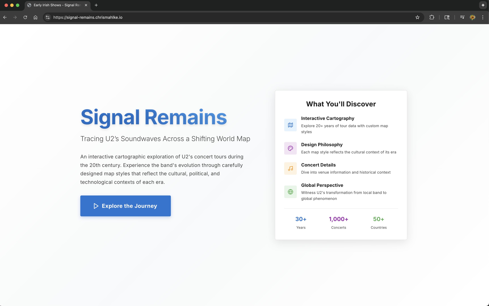
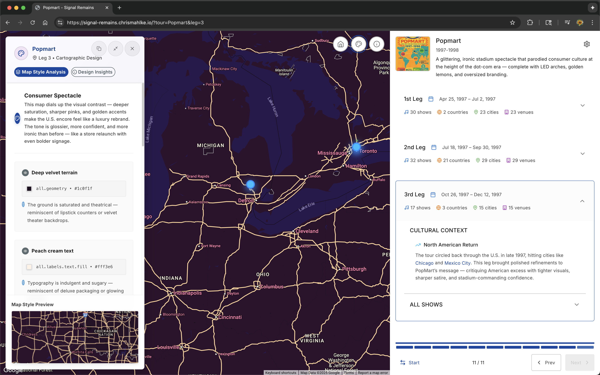
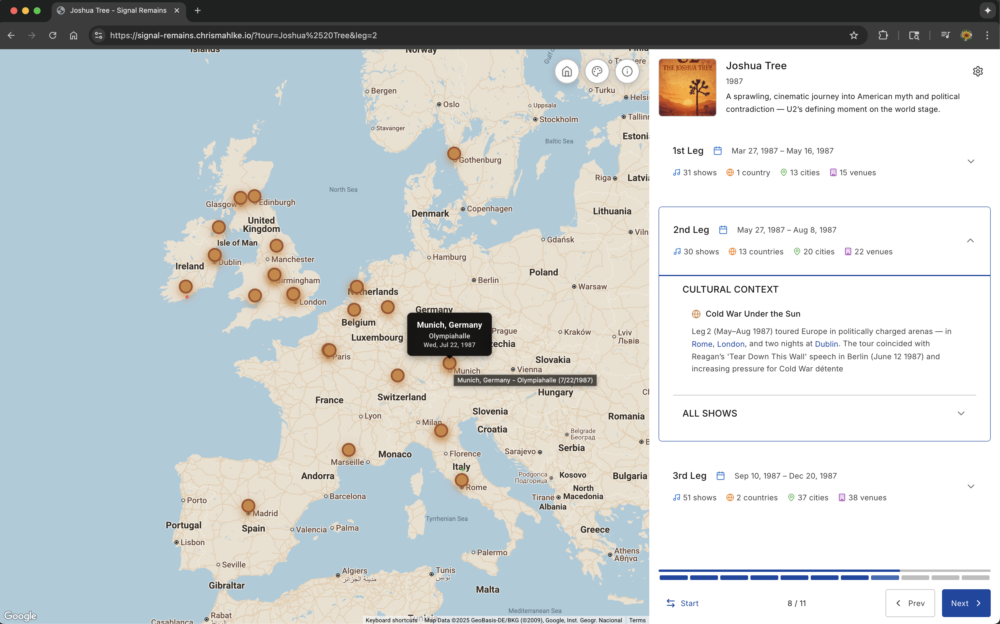

# Signal Remains

[](LICENSE)
[](https://www.typescriptlang.org/)
[](https://reactjs.org/)
[](https://vitejs.dev/)
[](https://mui.com/)
[](https://eslint.org/)
[](https://github.com/chrismahlke/signal-remains)
[](https://github.com/chrismahlke/signal-remains)
[](https://www.w3.org/WAI/WCAG2AAA-Conformance)
[](https://github.com/chrismahlke/signal-remains)
[](https://www.docker.com/)
[](https://cloud.google.com/run)
[](https://nodejs.org/)
[](https://cloud.google.com/build)
[](https://signal-remains.chrismahlke.io)

An interactive cartographic exploration of U2's concert tours during the 20th century. Experience the band's evolution through carefully designed map styles that reflect the cultural, political, and technological contexts of each era.

## 📸 Screenshots

### Homepage

*The landing page showcasing the project overview and key features*

### Cartogaphic Exploration

*Interactive map view with cartogaphic details and cultural context*

### Historical Context

*Detailed view of specific tour legs and concert information*

## ✨ Features

- **Interactive Cartography**: Explore 20+ years of tour data with custom map styles
- **Design Philosophy**: Each map style reflects the cultural context of its era
- **Concert Details**: Dive into venue information and historical context
- **Global Perspective**: Witness U2's transformation from local band to global phenomenon
- **Cultural Context**: Rich historical insights for each tour and leg
- **Responsive Design**: Works seamlessly across desktop and mobile devices

## 🚀 Live Demo

- **Production URL**: https://signal-remains.chrismahlke.io
- **Home**: https://chrismahlke.io

## 🛠️ Technology Stack

- **Frontend**: React 18.3, TypeScript 5.5, Vite 5.4
- **UI Framework**: Material-UI 7.2
- **Maps**: Google Maps JavaScript API with @vis.gl/react-google-maps
- **State Management**: Redux Toolkit
- **Styling**: Tailwind CSS, Emotion
- **Deployment**: Google Cloud Platform (Cloud Run)
- **CI/CD**: GitHub Actions with Cloud Build

## 🔄 CI/CD Pipeline

The deployment pipeline is configured in `cloudbuild.yaml` and follows this workflow:

1. **Development**: Work on the `develop` branch
2. **Testing**: Create pull requests from `develop` to `master`
3. **Deployment**: Merging to `master` triggers automatic deployment to GCP

## 🛠️ Local Development

### Prerequisites

- Node.js 18+ 
- npm or yarn

### Installation

```bash
# Clone the repository
git clone https://github.com/chrismahlke/signal-remains.git
cd signal-remains

# Install dependencies
npm install

# Start development server
npm run dev

# Build for production
npm run build

# Run linting
npm run lint
```

### Docker Development

```bash
# Build the Docker image
docker build -t signal-remains .

# Run the container
docker run -p 8080:80 signal-remains
```

## 📁 Project Structure

```
signal-remains/
├── src/
│   ├── components/          # React components
│   ├── data/               # Tour and concert data
│   ├── hooks/              # Custom React hooks
│   ├── lib/                # Utility functions
│   ├── store/              # Redux store configuration
│   ├── theme/              # Material-UI theme
│   └── types/              # TypeScript type definitions
├── public/
│   ├── data/               # JSON data files
│   └── images/             # Static images
├── docs/
│   └── images/             # Documentation images
├── api/                    # Express.js API server
├── dist/                   # Production build output
├── Dockerfile              # Container configuration
├── cloudbuild.yaml         # CI/CD pipeline configuration
└── README.md              # This file
```

## 🔧 GCP Configuration

- **Service**: Cloud Run

## 🔐 Required Secrets

The following GitHub secrets need to be configured:

- `GCP_SA_KEY`: Service account JSON key for GCP authentication

## 🌍 Environment Variables

The application uses the following environment variables:
- `VITE_GOOGLE_MAPS_API_KEY`: Google Maps JavaScript API key
- `GEMINI_API_KEY`: Gemini API key for AI features

## 🎯 Key Features

### Error Handling
- **Comprehensive Error Boundaries**: React error boundaries for graceful error recovery
- **Input Validation**: Robust data validation for API responses and user inputs
- **Graceful Degradation**: Fallback mechanisms for network issues and API failures
- **Timeout Protection**: 10-second timeouts prevent infinite loading states
- **Global Error Handlers**: Uncaught exception and unhandled rejection handlers

### Performance
- **Code Splitting**: React.lazy and Suspense for optimal bundle loading
- **Manual Chunk Splitting**: Optimized vendor bundle separation
- **Image Optimization**: WebP format with preloading strategies
- **Lazy Loading**: Heavy components loaded on-demand
- **Bundle Analysis**: Rollup optimization with size warnings

### Accessibility
- **WCAG AAA Compliance**: Highest accessibility standards met
- **Screen Reader Support**: Comprehensive ARIA labels and announcements
- **Keyboard Navigation**: Full keyboard accessibility
- **Skip Links**: Quick navigation for assistive technologies
- **Color Contrast**: AAA compliant color ratios
- **Focus Management**: Proper focus indicators and management

### Security
- **Input Sanitization**: HTML tag removal and length limiting
- **Type Safety**: Strict TypeScript configuration with no implicit any
- **API Key Security**: Secure handling of Google Maps and Gemini API keys
- **CORS Protection**: Strict origin validation for cross-origin requests
- **Security Headers**: X-Content-Type-Options, X-Frame-Options, X-XSS-Protection
- **Content Security Policy**: CSP headers for XSS prevention
- **ESLint Security Rules**: Automated security vulnerability detection
- **Data Validation**: Comprehensive validation for all API responses
- **Error Sanitization**: Safe error message handling without information leakage
- **Secret Management**: Google Cloud Secret Manager integration
- **Docker Security**: Minimal attack surface with optimized container

### Code Quality
- **Strict TypeScript**: No implicit any, strict null checks, exact types
- **ESLint Configuration**: 200+ rules for code quality and security
- **SonarJS Integration**: Advanced code quality analysis
- **Import Organization**: Automated import sorting and grouping
- **Consistent Formatting**: Enforced code style and formatting
- **Security Scanning**: Automated security vulnerability detection

## 🤝 Contributing

1. Fork the repository
2. Create a feature branch (`git checkout -b feature/amazing-feature`)
3. Commit your changes (`git commit -m 'Add some amazing feature'`)
4. Push to the branch (`git push origin feature/amazing-feature`)
5. Open a Pull Request

## 📄 License

This project is licensed under the MIT License - see the [LICENSE](LICENSE) file for details.

## 🙏 Acknowledgments

- U2 for the incredible music and tour history
- Google Maps for the mapping platform
- Material-UI for the beautiful component library
- The React and TypeScript communities for excellent tooling
